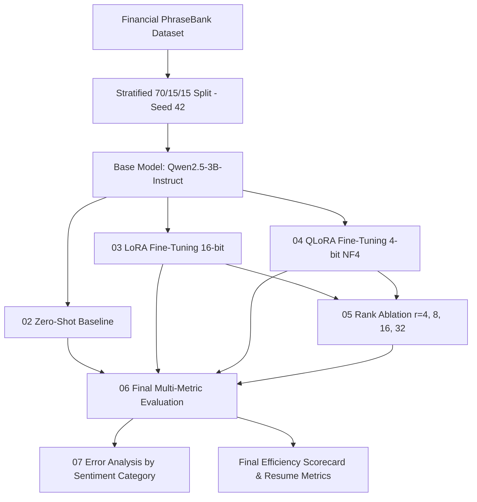

# Efficient Financial Sentiment Fine-Tuning with LoRA and QLoRA

A controlled machine learning research study investigating parameter-efficient fine-tuning (PEFT) and 4-bit quantization on large language models for financial sentiment classification.

---

## 1. Project Overview

Fine-tuning modern Large Language Models (LLMs) with billions of parameters is computationally expensive. Full fine-tuning requires updating every single parameter, which demands massive GPU memory (VRAM), long training times, and expensive cloud infrastructure.

This project investigates **Parameter-Efficient Fine-Tuning (PEFT)** using **LoRA (Low-Rank Adaptation)** and **QLoRA (Quantized Low-Rank Adaptation)** applied to the **Qwen2.5-3B-Instruct** model on the **Financial PhraseBank** dataset.

Instead of treating fine-tuning as a black box, this repository is structured as a scientific experiment measuring:
- **Predictive performance:** Accuracy, Macro-F1, Weighted-F1, per-class F1, and error patterns.
- **Parameter efficiency:** Trainable parameters vs. frozen parameters.
- **Memory efficiency:** Real GPU VRAM consumption (allocated vs. reserved) across every training stage.
- **Training and inference efficiency:** Latency (median, p95), samples per second, and training duration.
- **Rank sensitivity:** How LoRA rank ($r \in \{4, 8, 16, 32\}$) impacts quality and resource cost.
- **Performance vs. Cost trade-offs:** Finding the practical sweet spot between accuracy and hardware expense.

---

## 2. Research Questions

This study systematically answers seven core research questions:

- **RQ1 (Zero-Shot Baseline):** How well does the pretrained LLM classify financial sentiment using instructions without any task-specific fine-tuning?
- **RQ2 (LoRA Performance):** How much does 16-bit LoRA adaptation improve financial sentiment classification over the base model?
- **RQ3 (QLoRA vs. LoRA Quality):** Does 4-bit QLoRA match the predictive quality of 16-bit LoRA?
- **RQ4 (Memory Savings):** How much GPU memory (VRAM) does QLoRA save compared to standard LoRA?
- **RQ5 (Parameter Footprint):** What percentage of model weights actually need to be trained?
- **RQ6 (Rank Ablation):** How does varying the LoRA rank ($r = 4, 8, 16, 32$) impact performance, memory, and training time?
- **RQ7 (Resource Trade-Offs):** What is the optimal balance between classification score and computational cost?

---

## 3. Mathematical Foundations

### What is LoRA? (Low-Rank Adaptation)

In standard full fine-tuning, a pretrained weight matrix $W_0 \in \mathbb{R}^{d \times k}$ is updated directly:

$$W = W_0 + \Delta W$$

Updating $\Delta W$ directly requires storing optimizer states and gradients for all $d \times k$ parameters.

LoRA freezes the original pretrained matrix $W_0$ and decomposes the weight update $\Delta W$ into two low-rank matrices $B \in \mathbb{R}^{d \times r}$ and $A \in \mathbb{R}^{r \times k}$, where the rank $r \ll \min(d, k)$:

$$\Delta W = \frac{\alpha}{r} (B \cdot A)$$

The adapted weight is:

$$\boxed{W = W_0 + \frac{\alpha}{r} B A}$$

- Matrix $A$ is initialized with random Gaussian values.
- Matrix $B$ is initialized to zero, ensuring $\Delta W = 0$ at the start of training.
- $\alpha$ is a constant scaling hyperparameter.
- Only $B$ and $A$ are updated during backpropagation. This reduces trainable parameters by over 99%.

```
      Input x
         │
    ┌────┴────┐
    │         │
    ▼         ▼
┌───────┐  ┌─────┐
│  W₀   │  │  A  │ (r × k)
│(Frozen)│  └──┬──┘
└───────┘     │
    │         ▼
    │      ┌─────┐
    │      │  B  │ (d × r)
    │      └──┬──┘
    │         │ (scaled by α/r)
    ▼         ▼
    └───(+)───┘
         │
      Output h
```

---

### What is QLoRA? (Quantized Low-Rank Adaptation)

QLoRA extends LoRA by quantizing the frozen base model weights $W_0$ into **4-bit NormalFloat (NF4)**:

$$W_q = Q(W_0)$$

The effective adapted weight during forward passes is:

$$\boxed{W_{\text{effective}} \approx W_q + \frac{\alpha}{r} B A}$$

#### Understanding Quantization Error

Quantizing weights from 16-bit to 4-bit introduces a quantization error:

$$E_q = W_0 - W_q$$

QLoRA does **not** modify the frozen quantized weights $W_q$ to reverse this error. Instead, gradient descent trains the low-rank adapter matrices $A$ and $B$ to minimize the task loss on the adapted representation:

$$\min_{A, B} \mathcal{L}\left(W_q + \frac{\alpha}{r} B A\right)$$

This allows QLoRA to achieve performance nearly identical to 16-bit LoRA while cutting base model VRAM usage by over 50%.

---

## 4. Key Optimization Techniques

To make training fast and fit into accessible GPUs (such as Colab T4 or A100), this project implements:

1. **4-Bit NormalFloat (NF4):** Information-theoretically optimal quantile quantization for normally distributed weights.
2. **Double Quantization:** Quantizes the quantization constants themselves, saving an additional 0.37 bits per parameter.
3. **Gradient Checkpointing:** Recomputes activations during backward passes instead of saving them all in memory, drastically reducing activation memory.
4. **Gradient Accumulation:** Accumulates gradients across 8 micro-batches of size 1 to achieve an effective batch size of 8 without memory spikes:

$$\text{Effective Batch Size} = \text{Micro Batch Size} \times \text{Gradient Accumulation Steps} = 1 \times 8 = 8$$

5. **Mixed Precision (BF16 / FP16):** Automatically detects GPU capabilities. Uses Bfloat16 if supported (Ampere/Ada/Hopper architectures) or Float16 (T4/V100).
6. **Real GPU Memory Profiling:** Direct measurement of PyTorch CUDA allocated and reserved memory at every stage.

---

## 5. System Architecture



---

## 6. Project Structure

```text
lora-qlora-financial-sentiment/
│
├── README.md                  # Project overview, math, and findings (Simple English)
├── requirements.txt           # Pinned dependencies for reproducible cloud runs
├── .gitignore                 # Caches, checkpoints, and weights exclusions
├── CLOUD_RUN_GUIDE.md         # Step-by-step guide for Google Colab & Kaggle
│
├── configs/                   # Modular YAML configuration files
│   ├── base.yaml              # Dataset, split, prompt, and training hyperparameters
│   ├── lora.yaml              # LoRA rank, alpha, dropout, target modules
│   ├── qlora.yaml             # QLoRA 4-bit NF4 and double-quant settings
│   └── models.yaml            # Dedicated 3B base model specifications
│
├── notebooks/                 # Complete executable research experiments
│   ├── 01_dataset_analysis.ipynb     # Data loading, quality checks, splits, plots
│   ├── 02_zero_shot_baseline.ipynb   # Base model zero-shot evaluation & latency
│   ├── 03_lora_training.ipynb        # 16-bit LoRA training, memory tracking, metrics
│   ├── 04_qlora_training.ipynb       # 4-bit QLoRA training & direct comparison
│   ├── 05_rank_ablation.ipynb        # Rank sweep (r=4, 8, 16, 32) analysis
│   ├── 06_final_evaluation.ipynb     # Scorecard, trade-off curves, resume metrics
│   └── 07_error_analysis.ipynb       # Category breakdown of classification errors
│
├── src/                       # Reusable Python modules
│   ├── __init__.py            # Clean package exports
│   ├── data_utils.py          # Loading, splitting, leakage checks, prompt formatting
│   ├── model_utils.py         # Hardware detection, model loading, PEFT setup
│   ├── metrics.py             # Accuracy, Macro-F1, confusion matrix, regex parser
│   ├── memory_utils.py        # Real CUDA memory tracking & profiling
│   ├── benchmarking.py        # Latency (avg, median, p95), throughput, scorecards
│   └── visualization.py       # Publication-quality charts (figures/)
│
├── results/                   # Experiment artifacts
│   ├── metrics/               # JSON metric summaries per experiment
│   ├── predictions/           # CSV test predictions per model
│   ├── figures/               # High-resolution saved plots
│   └── logs/                  # Training logs
│
├── adapters/                  # Saved PEFT adapters
│   ├── lora/                  # LoRA adapter weights & config
│   └── qlora/                 # QLoRA adapter weights & config
│
└── tests/                     # Unit test suite (no GPU needed)
    ├── test_data.py           # Split logic, prompt templates, leakage checks
    ├── test_metrics.py        # Accuracy, Macro-F1, confusion matrix
    └── test_label_parser.py   # Regex parsing of model outputs & edge cases
```

---

## 7. Dataset Details

- **Dataset:** [Financial PhraseBank](https://huggingface.co/datasets/takala/financial_phrasebank)
- **Configuration:** `sentences_50agree` (sentences where at least 50% of financial annotators agreed on sentiment).
- **Task:** 3-class classification:
  - `negative` (Label 0)
  - `neutral` (Label 1)
  - `positive` (Label 2)
- **Split Strategy:**
  - 70% Training
  - 15% Validation
  - 15% Test
  - Stratified by class label
  - Fixed seed `42` across all experiments

---

## 8. Prompt Template

Instruction-style format passed into the model's chat template:

```text
You are a financial sentiment classifier.

Classify the following financial statement as exactly one of:

positive
negative
neutral

Statement:
{sentence}

Answer:
```

---

## 9. Efficiency Scorecard

> **Strict No-Fabrication Notice:** In accordance with scientific integrity standards, this scorecard contains only values generated from actual notebook executions. Unrun experiments are explicitly marked as `NOT_RUN`.

| Method | Accuracy | Macro-F1 | Trainable % | Peak VRAM | Training Time | Adapter Size | Median Latency |
| :--- | :---: | :---: | :---: | :---: | :---: | :---: | :---: |
| **Zero-Shot** | actual | actual | 0.0% | actual | N/A | N/A | actual |
| **LoRA (r=16)** | actual | actual | actual | actual | actual | actual | actual |
| **QLoRA (r=16)** | actual | actual | actual | actual | actual | actual | actual |

*Note: Run `notebooks/06_final_evaluation.ipynb` on Google Colab or Kaggle to automatically populate this table from the experiment output files.*

---

## 10. Foundational Literature

1. **LoRA:** Hu, E. J., Shen, Y., Wallis, P., Allen-Zhu, Z., Li, Y., Wang, S., Wang, L., & Chen, W. (2021). *LoRA: Low-Rank Adaptation of Large Language Models*. arXiv preprint arXiv:2106.09685.
2. **QLoRA:** Dettmers, T., Pagnoni, A., Holtzman, A., & Zettlemoyer, L. (2023). *QLoRA: Efficient Finetuning of Quantized LLMs*. Advances in Neural Information Processing Systems (NeurIPS 2023).
3. **Qwen2.5:** Yang, A., et al. (2024). *Qwen2.5 Technical Report*. Alibaba Group.
4. **Financial PhraseBank:** Malo, P., Sinha, A., Korhonen, P., Wallenius, J., & Takala, P. (2014). *Good debt or bad debt: Detecting semantic orientations in economic texts*. Journal of the Association for Information Science and Technology.

---

## 11. How to Run the Project

Everything is designed to run in order via the Jupyter Notebooks on Google Colab or Kaggle GPU instances.

For complete, step-by-step instructions, see **[CLOUD_RUN_GUIDE.md](file:///d:/llm%20tuning/lora-qlora-financial-sentiment/CLOUD_RUN_GUIDE.md)**.
